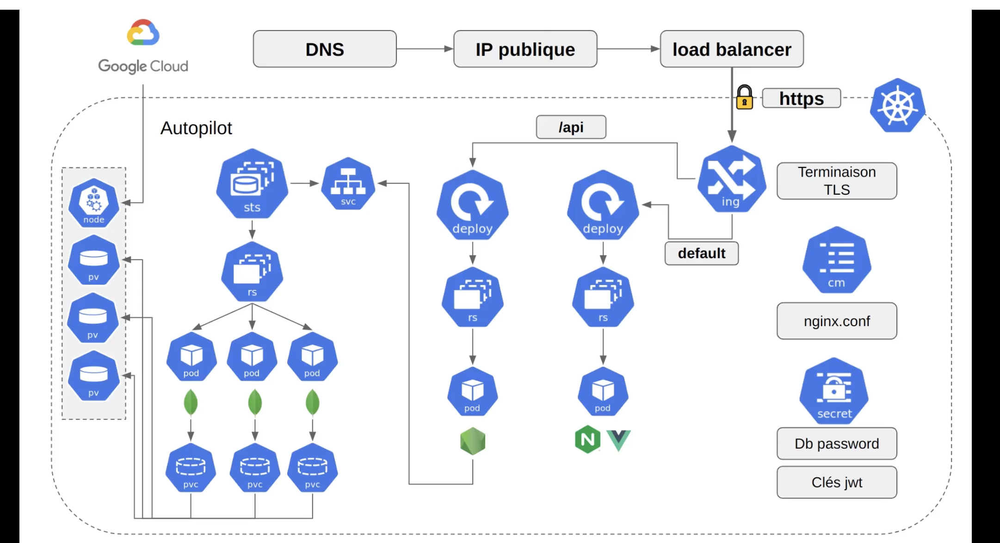
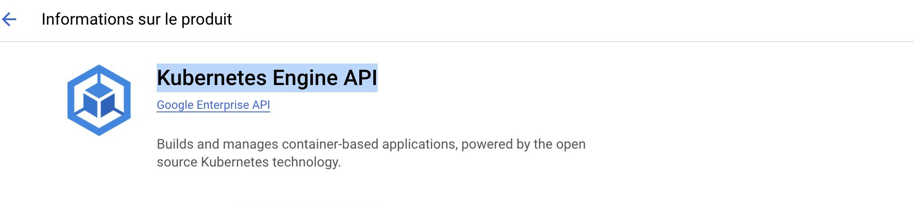
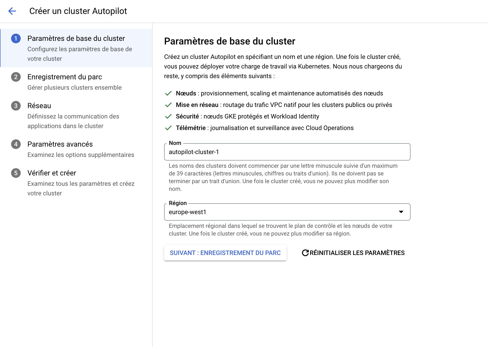
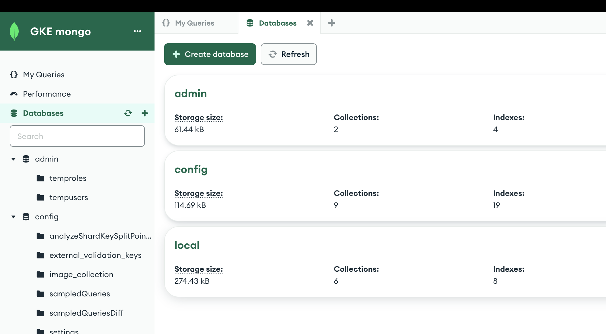

Activate your GCP account
https://console.cloud.google.com/





Install
https://cloud.google.com/sdk/docs/install
./google-cloud-sdk/install.sh
./google-cloud-sdk/bin/gcloud init

python3 -V
google-cloud-cli-463.0.0-darwin-x86_64.tar.gz

gcloud auth login
gcloud components install gke-gcloud-auth-plugin
gke-gcloud-auth-plugin --version
Kubernetes v1.28.2-alpha+58ec6ae34b7dcd9699b37986ccb12b3bbac88f00

gcloud container clusters get-credentials autopilot-cluster-1 --region europe-west1 --project clean-framework-413819

Only read
kubectl create secret docker-registry docker-hub-secret --docker-server=https://index.docker.io/v1/ --docker-username=gleo50 --docker-password=dckr_pat_wMCKey8TCwZoi3qHhH9EfT8ggh8 --docker-email=guillaume.lenoir@gleo.fr

kubectl config current-context

## MongoDB

helm repo add bitnami https://charts.bitnami.com/bitnami
go to helm
helm show values bitnami/mongodb > mongodb.yaml
helm install -f mongodb.yaml mongodb bitnami/mongodb
kubectl logs pod/mongodb-0 -f

MongoDB&reg; can be accessed on the following DNS name(s) and ports from within your cluster:

```
** Please be patient while the chart is being deployed **

MongoDB&reg; can be accessed on the following DNS name(s) and ports from within your cluster:

    mongodb-0.mongodb-headless.default.svc.cluster.local:27017
    mongodb-1.mongodb-headless.default.svc.cluster.local:27017
    mongodb-2.mongodb-headless.default.svc.cluster.local:27017

To get the root password run:

    export MONGODB_ROOT_PASSWORD=$(kubectl get secret --namespace default mongodb -o jsonpath="{.data.mongodb-root-password}" | base64 -d)

To connect to your database, create a MongoDB&reg; client container:

    kubectl run --namespace default mongodb-client --rm --tty -i --restart='Never' --env="MONGODB_ROOT_PASSWORD=$MONGODB_ROOT_PASSWORD" --image docker.io/bitnami/mongodb:7.0.5-debian-11-r6 --command -- bash

Then, run the following command:
mongosh admin --host "mongodb-0.mongodb-headless.default.svc.cluster.local:27017,mongodb-1.mongodb-headless.default.svc.cluster.local:27017,mongodb-2.mongodb-headless.default.svc.cluster.local:27017" --authenticationDatabase admin -u $MONGODB_ROOT_USER -p $MONGODB_ROOT_PASSWORD

To access the MongoDB&reg; Prometheus metrics, get the MongoDB&reg; Prometheus URL by running:

    kubectl port-forward --namespace default svc/mongodb-metrics 9216:9216 &
    echo "Prometheus Metrics URL: http://127.0.0.1:9216/metrics"

Then, open the obtained URL in a browser.


 kubectl get all
NAME                    READY   STATUS              RESTARTS   AGE
pod/mongodb-0           2/2     Running             0          5m27s
pod/mongodb-1           2/2     Running             0          4m1s
pod/mongodb-2           0/2     ContainerCreating   0          103s
pod/mongodb-arbiter-0   1/1     Running             0          5m27s

NAME                               TYPE        CLUSTER-IP       EXTERNAL-IP   PORT(S)     AGE
service/kubernetes                 ClusterIP   34.118.224.1     <none>        443/TCP     42m
service/mongodb-arbiter-headless   ClusterIP   None             <none>        27017/TCP   5m28s
service/mongodb-headless           ClusterIP   None             <none>        27017/TCP   5m28s
service/mongodb-metrics            ClusterIP   34.118.228.174   <none>        9216/TCP    5m28s

NAME                               READY   AGE
statefulset.apps/mongodb           2/3     5m28s
statefulset.apps/mongodb-arbiter   1/1     5m28s

```

kubectl get secret --namespace default mongodb -o jsonpath="{.data.mongodb-root-password}" | base64 -d

kubectl run --namespace default mongodb-client --rm --tty -i --restart='Never' --env="MONGODB_ROOT_PASSWORD=XXXX" --image docker.io/bitnami/mongodb:7.0.5-debian-11-r6 --command -- bash

mongosh admin --host "mongodb-0.mongodb-headless.default.svc.cluster.local:27017,mongodb-1.mongodb-headless.default.svc.cluster.local:27017,mongodb-2.mongodb-headless.default.svc.cluster.local:27017" --authenticationDatabase admin -u $MONGODB_ROOT_USER -p $MONGODB_ROOT_PASSWORD

Using MongoDB: 7.0.5
Using Mongosh: 2.1.3

kubectl port-forward --namespace default service/mongodb-headless 27017
add mongodb-0.mongodb-headless.default.svc.cluster.local to etc/host
go to compass
kubectl logs pod/mongodb-0 -f



bash generate_secrets.sh

kubectl apply -f k8s/
kubectl get pod -w
NAME READY STATUS RESTARTS AGE
api-deployment-7b7476474f-72clt 0/1 ContainerCreating 0 5s
frontend-deployment-856c7fb959-l2w67 0/1 ContainerCreating 0 4s
...

exec /usr/local/bin/docker-entrypoint.sh: exec format error  
arm64 issue ?

kubectl logs api-deployment-7b7476474f-72clt
