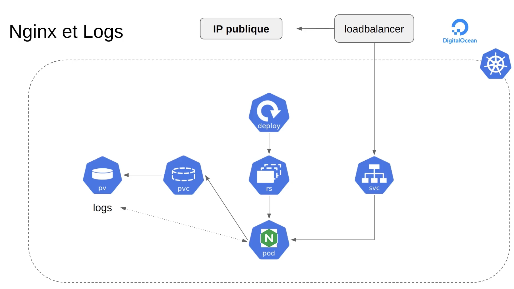

cd nginx
docker build -t gleo/projet4-nginx .

delete all ->
kubectl delete -f k8s/
kubectl get all
kubectl get pvc
kubectl get pv

Build all ->
kubectl apply -f k8s/
kubectl get svc
minikube service php-nginx-service --url

![Alt text](image-1.png

kubectl delete pods --all

kubectl create secret docker-registry docker-hub-secret --docker-server=https://registry-1.docker.io/v2/ --docker-username=gleo59 --docker-password=xxxx --docker-email=guillaume.lenoir@gleo.fr

kubectl get secret docker-hub-secret --output="jsonpath={.data.\.dockerconfigjson}" | base64 --decode

kubectl patch serviceaccount default -p '{"imagePullSecrets": [{"name": "docker-hub-secret"}]}' -n default

kubectl apply -f k8s/

force reload image

kubectl rollout restart deployment php-nginx-deployment

kubectl exec -it pod/mysql-statefulset-0 -- bash

helm upgrade --install ingress-nginx ingress-nginx/ingress-nginx \
 --set controller.service.annotations."service\.beta\.kubernetes\.io/azure-load-balancer-health-probe-request-path"=/healthz

## NGINX Ingress Controller

helm repo add ingress-nginx https://kubernetes.github.io/ingress-nginx
helm repo update
helm install ingress-nginx ingress-nginx/ingress-nginx \
 --set controller.service.annotations."service\.beta\.kubernetes\.io/azure-load-balancer-health-probe-request-path"=/healthz

kubectl get svc -o wide

kubectl apply -f k8s/letsencrypt-issuer.yaml
kubectl describe clusterissuers letsencrypt

kubectl apply -f k8s/nginx-ingress.yaml

kubectl get certificate
kubectl describe certificate
kubectl describe certificaterequest
kubectl describe order
kubectl describe challenge
