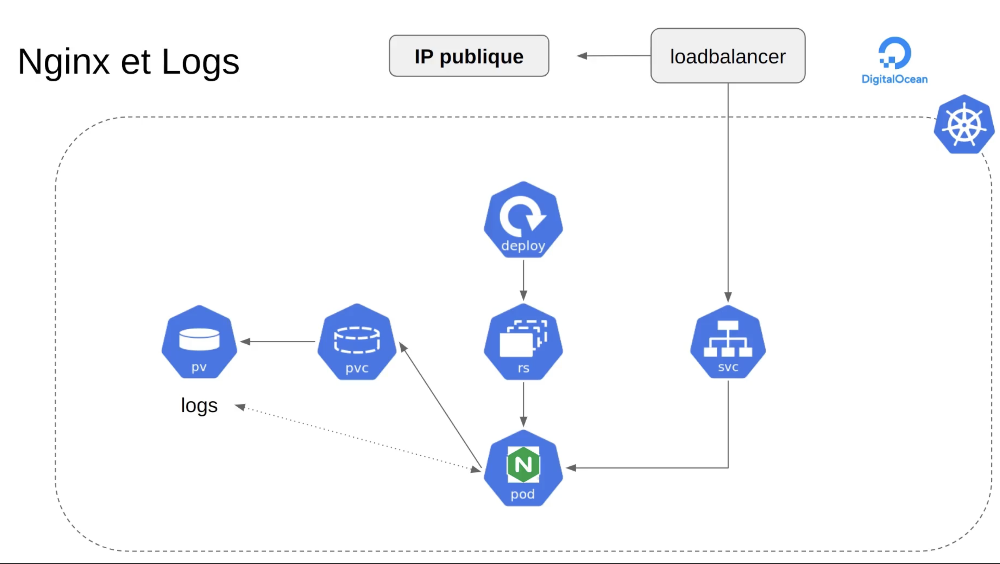

cd nginx
docker build -t gleo/projet4-nginx .

delete all ->
kubectl delete -f k8s/
kubectl get all
kubectl get pvc
kubectl get pv

Build all ->
kubectl apply -f k8s/
kubectl get svc
minikube service php-nginx-service --url

![Alt text](image-1.png

kubectl delete pods --all

kubectl create secret docker-registry docker-hub-secret --docker-server=https://registry-1.docker.io/v2/ --docker-username=gleo59 --docker-password=dckr_pat_FVThFg4jYHX2Lms8tnq19_rjV38 --docker-email=guillaume.lenoir@gleo.fr

kubectl get secret docker-hub-secret --output="jsonpath={.data.\.dockerconfigjson}" | base64 --decode

kubectl patch serviceaccount default -p '{"imagePullSecrets": [{"name": "docker-hub-secret"}]}' -n default

kubectl apply -f k8s/

force reload image

kubectl rollout restart deployment php-nginx-deployment
