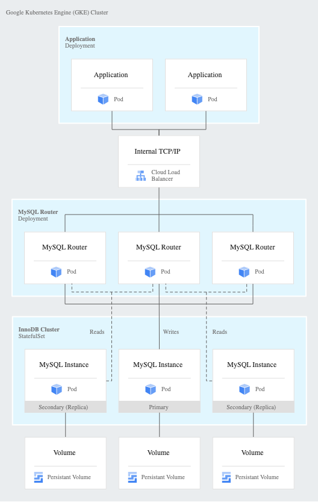

cd nginx
docker build -t dymafr/projet3-nginx .

delete all ->
kubectl delete -f k8s/
kubectl get all
kubectl get pvc
kubectl get pv

Build all ->
kubectl apply -f k8s/
kubectl get svc
minikube service php-nginx-service --url

