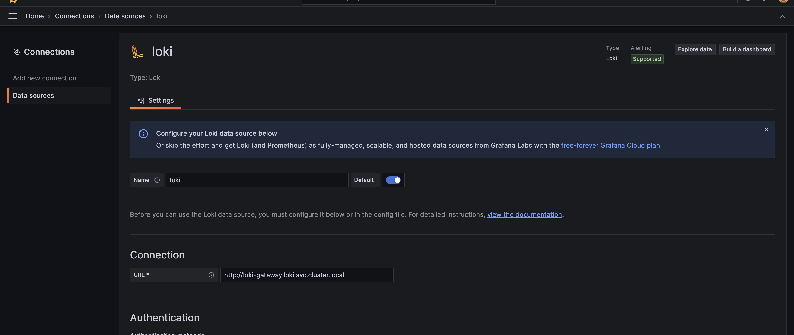
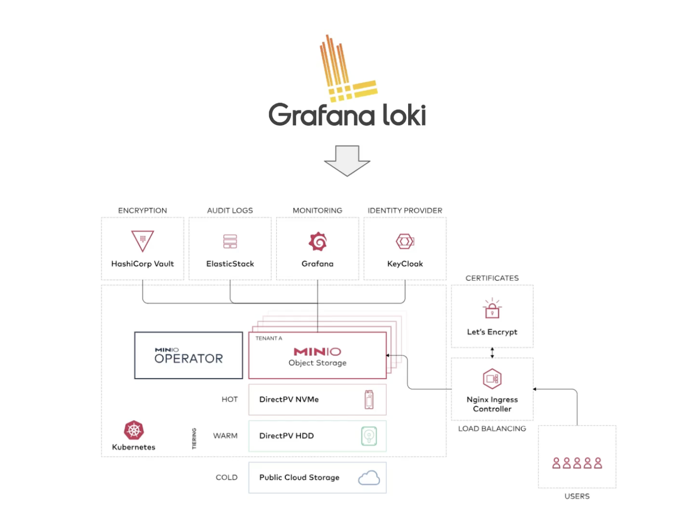
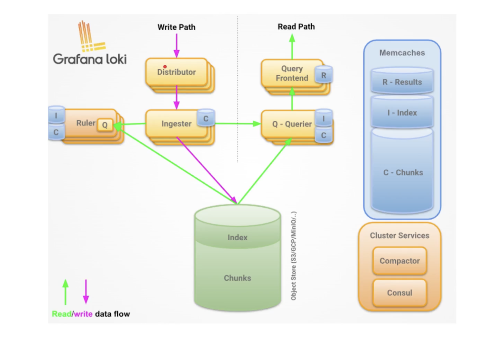
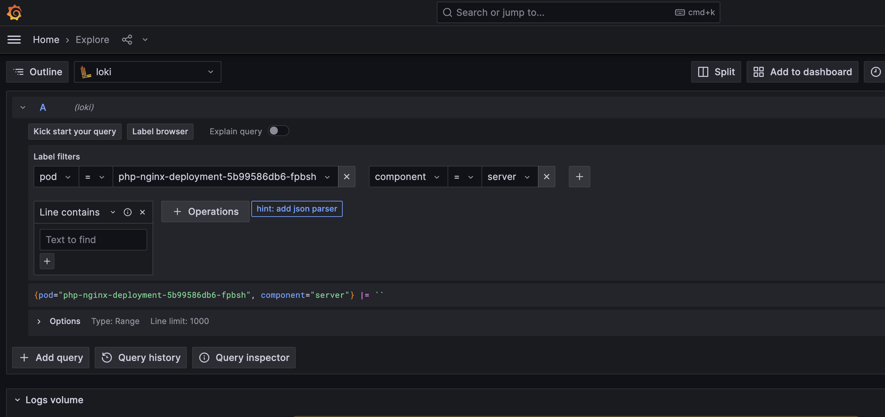
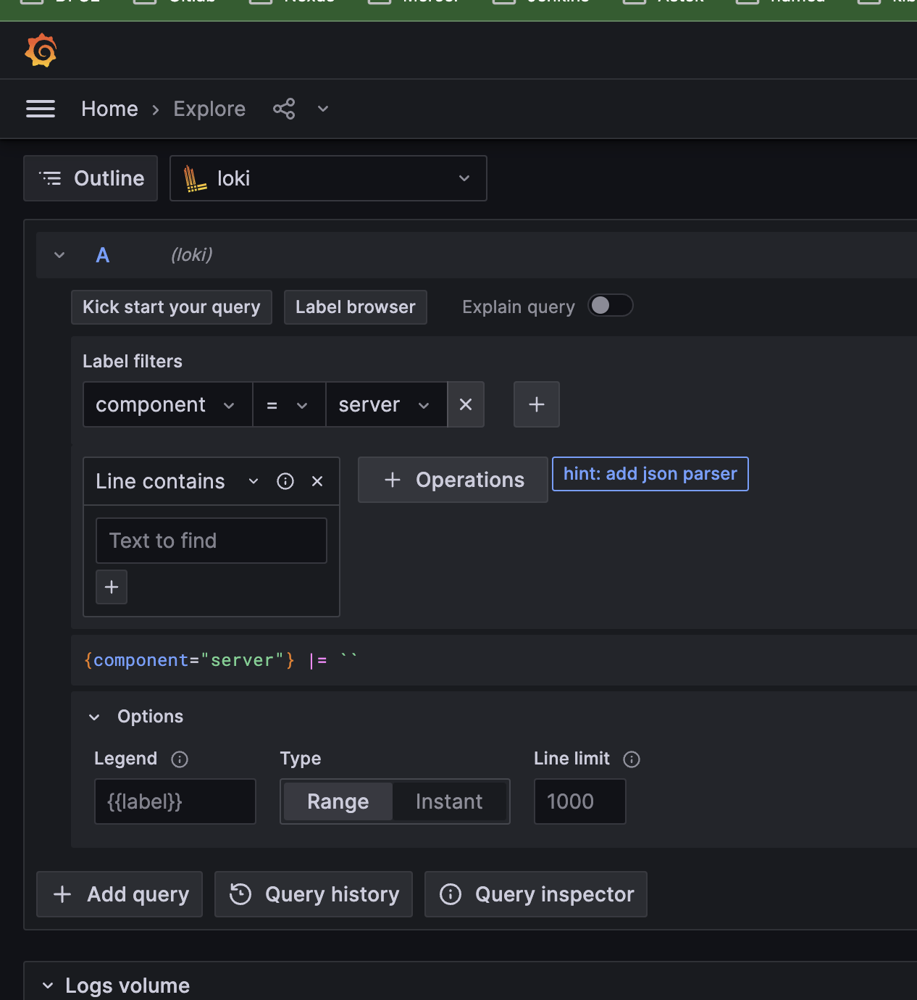

helm repo add grafana https://grafana.github.io/helm-charts
helm repo update
helm search repo grafana
helm upgrade --install --namespace loki logging grafana/loki -f values.yaml --set loki.auth_enabled=false
kubectl get all -n loki

helm repo add prometheus-community https://prometheus-community.github.io/helm-charts
helm install prometheus prometheus-community/prometheus -n loki
helm search repo prometheus-community
kubectl get all -n loki

NOTES:
The Prometheus server can be accessed via port 80 on the following DNS name from within your cluster:
prometheus-server.loki.svc.cluster.local
Go to graphana add source fill prometheus-server.loki.svc.cluster.local

helm list -n loki
helm delete grafana -n loki
kubectl get all -n loki
kubectl delete all --all -n loki --force
