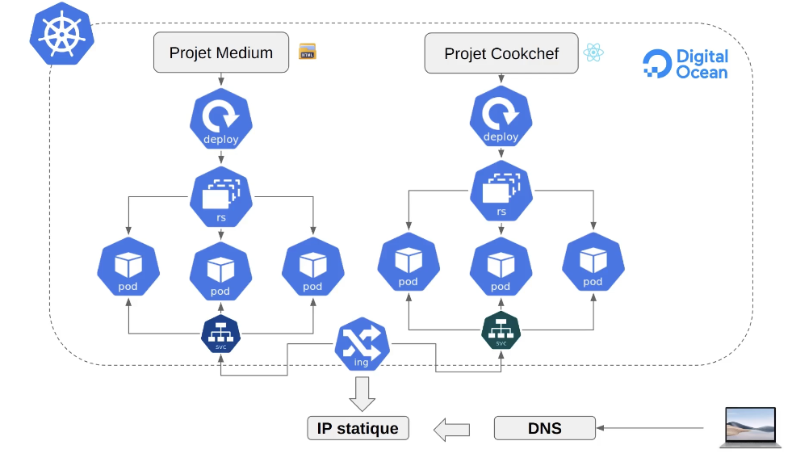

ubectl delete service k8c4-service

kubectl apply -f deploy-app2.yaml
kubectl get pod -o wide
kubectl apply -f premier-service.yaml
kubectl apply -f service-app2.yaml

Installation de l'Ingress

kubectl apply -f mon-ingress.yaml

minikube start

minikube addons enable ingress

minikube addons enable ingress-dns

Wait until you see the ingress-nginx-controller-XXXX is up and running using Kubectl get pods -n ingress-nginx

Create an ingress using the K8s example yaml file

Update the service section to point to the NodePort Service that you already created

Append 127.0.0.1 nginx-dyma.site to your /etc/hosts file on MacOS (NOTE: Do NOT use the Minikube IP)

Append 127.0.0.1 nginx-dyma.store to your /etc/hosts file on MacOS (NOTE: Do NOT use the Minikube IP)

Run minikube tunnel ( Keep the window open. After you entered the password there will be no more messages, and the cursor just blinks)

Hit the nginx-dyma.store ( or whatever host you configured in the yaml file) in a browser and it should work

N'oublions pas de pointer les entrées A de la zone DNS des domaines http://nginx-dyma.store/ et http://nginx-dyma.site vers l'IP publique.
